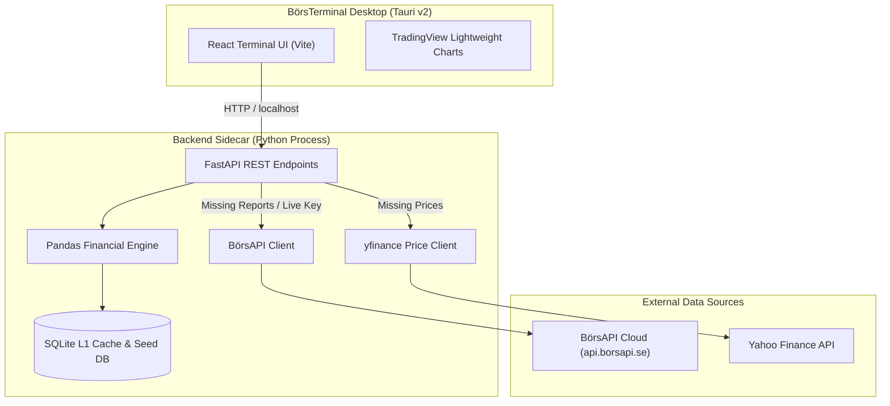

# BörsTerminal – Open Source Desktop Aktieterminal

[](LICENSE)
[](https://tauri.app)
[](https://react.dev)
[](https://fastapi.tiangolo.com)
[](https://borsapi.se)

**BörsTerminal** är en öppen desktop-applikation för finansiell aktieanalys av svenska noterade bolag. Applikationen fungerar både som ett analysverktyg och som referensimplementation för [BörsAPI](https://borsapi.se).

Släppt under **MIT-licensen** för att uppmuntra finansiell källkodsinnovation på den svenska marknaden.

---

## Höjdpunkter och Funktioner

* **Classic Finance UI:** Mörkt, stilrent och kompakt gränssnitt optimerat för hög informationstäthet (React 18, Tailwind CSS, `shadcn/ui`).
* **TradingView Lightweight Charts:** Interaktiva Candlestick-kurser, volymhistogram samt tekniska medelvärden (SMA 50 och SMA 200).
* **Python Sidecar och Pandas Engine:** Lokal FastAPI-sidecar som räknar ut **TTM (Trailing Twelve Months)** för omsättning och vinst, samt P/E, P/S, EBIT-marginal och fritt kassaflöde.
* **Lokal SQLite L1 Cache:** Snabb appstart i WAL-läge som minimerar anrop mot externa servrar.
* **Out-of-the-Box Demo Mode:** Levereras med komplett historisk frödata för 5 svenska storbolag (*Volvo AB*, *Investor AB*, *H&M*, *SEB*, *Sandvik*) utan krav på nyckel.
* **BörsAPI Live Integration:** Länk till [BörsAPI](https://borsapi.se) för att hämta en gratis API-nyckel (100 anrop) och låsa upp hela den svenska marknaden.

---

## Systemarkitektur



---

## Snabbstart för Utvecklare

### Förutsättningar
* **Node.js** (v18+) och **npm**
* **Python** (v3.10+)
* **Rust** (endast om du vill bygga den installerbara Tauri-binären)

### Installation och Lokal Utveckling

```bash
# 1. Klona repositoryt
git clone https://github.com/sibb74/BorsTerminal.git
cd BorsTerminal

# 2. Installera Frontend-dependencies
npm install

# 3. Sätt upp Python-miljö och installera backend-dependencies
python3 -m venv .venv
source .venv/bin/activate  # På Windows: .venv\Scripts\activate
pip install -r src-sidecar/requirements.txt

# 4. Starta utvecklingsmiljön (FastAPI och Vite)
npm run dev
```

För att starta appen i ett Tauri desktop-fönster:
```bash
npm run tauri dev
```

---

## Bygga för Release (.dmg / .msi)

För att kompilera Python-sidecarn med PyInstaller och bygga installerbara paket för macOS eller Windows:

```bash
# Kompilera Python-sidecarn till fristående binär
python scripts/build_sidecar.py

# Bygg Tauri-appen
npm run build
npm run tauri build
```

---

## Bidra och Community

Vill du lägga till en ny teknisk indikator eller förbättra tabellvisningen? Läs vår [CONTRIBUTING.md](CONTRIBUTING.md) guide.

---

## Licens

Släppt under [MIT-licensen](LICENSE). © 2026 BörsTerminal Contributors och [BörsAPI](https://borsapi.se).
